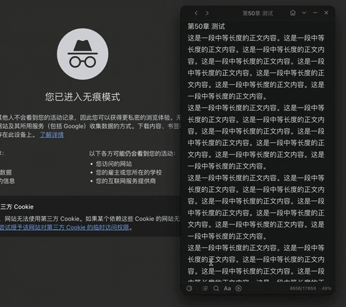
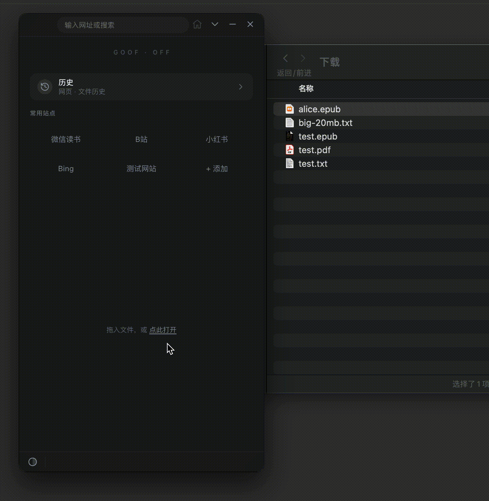
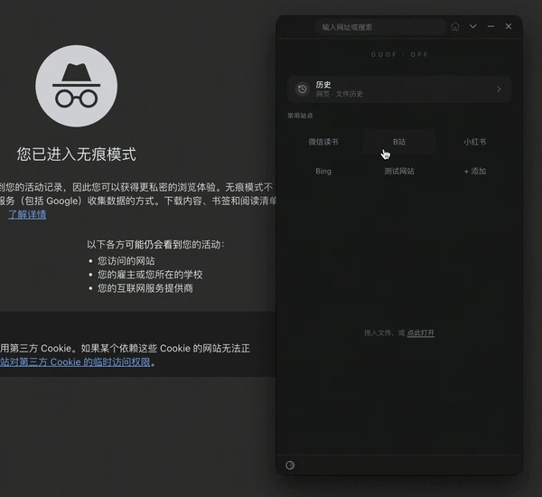

简体中文 | [English](./README.en.md)

<div align="center">


# Goof Off

**把网页与本地文档收进一扇随时可隐藏的小窗。**

集成 TXT、EPUB、PDF 阅读与网页浏览，支持背景透明、自动隐藏、鼠标穿透和全局老板键。


[**下载安装**](#下载安装) · [**3 分钟上手**](#3-分钟上手) · [**移动窗口**](#移动窗口) · [**功能一览**](#功能一览) · [**开发与贡献**](#开发与贡献)

</div>

<p align="center">
  
</p>

<p align="center"><sub>macOS 实录界面；Windows 11 具备相同核心能力。</sub></p>

## 为什么选择 Goof Off

- **需要时隐去**：开启背景隐去后，内容可直接浮在桌面上；还可继续淡化界面，在鼠标移出窗口后自动隐藏工具栏或阅读内容。阅读内容隐藏时，鼠标点击可直接作用于下层窗口。
- **统一阅读入口**：网页、TXT、EPUB 和 PDF 都能在同一窗口中打开；将本地文件拖入窗口，应用会自动识别格式。
- **离开后继续阅读**：每个文件都会单独记录阅读进度，常用排版和阅读模式也会保留。
- **数据留在本机**：无需注册账号，也不会同步到云端；阅读进度、偏好和历史均保存在本机，历史记录可随时关闭或清空。

## 下载安装

前往 [Releases](https://github.com/triWater-Chen/goof-off/releases) 下载最新版本：

| 平台                | 下载文件                                             | 说明                           |
| ------------------- | ---------------------------------------------------- | ------------------------------ |
| Windows 11 x64      | `Goof-Off-x.x.x-Setup.exe`                           | 安装版，可选择安装目录         |
| Windows 11 x64      | `Goof-Off-x.x.x-Portable.zip`                        | 完整解压后直接运行目录内 exe   |
| macOS Apple Silicon | `Goof-Off-x.x.x-mac.dmg` 或 `Goof-Off-x.x.x-mac.zip` | 适用于 Apple 芯片（M 系列）Mac |

> 当前发布包尚未配置受信任的开发者签名，因此系统可能显示安全提示。Windows 出现 SmartScreen 时，请选择「更多信息 → 仍要运行」；macOS 提示无法验证开发者时，请在 Finder 中右键应用并选择「打开」。请仅从本仓库的 Releases 页面下载。

Windows 便携版必须先完整解压，并保留目录内全部文件；之后直接运行 `goof-off-app.exe`，不会在每次启动时重复释放临时文件。

<details>
<summary><strong>从源码运行</strong></summary>

需要 Node.js ≥ 22.12.0、npm ≥ 10.9.3。

```bash
git clone https://github.com/triWater-Chen/goof-off.git
cd goof-off
npm install
npm run dev
```

</details>

## 3 分钟上手

1. **打开本地文件**：将一个 `.txt`、`.epub` 或 `.pdf` 文件拖入窗口，也可以点击主页底部的「点此打开」。
2. **开始阅读**：底栏会根据文件格式显示目录、搜索、排版、自动翻页或缩放等常用工具。
3. **浏览网页**：在顶部输入网址或关键词并按下回车键，也可以直接打开主页中的常用站点。
4. **退出与续读**：正常退出即可，应用默认保存当前位置；下次启动时可自动回到上次浏览的网页或阅读的文件。

<p align="center">
  
</p>

<p align="center"><sub>TXT 阅读 → 章节目录 → 全文搜索。</sub></p>

### 读第一本书

- **TXT**：应用会自动识别章节并生成目录；搜索结果显示在底部面板中，匹配内容会在正文中同步高亮。若出现乱码，请打开「排版」，手动切换 UTF-8、GBK、GB2312 或 Big5 编码。
- **EPUB**：可在「排版」中切换滚动或翻页模式，并调整字号、行距和字体；同时支持目录与全书搜索。正文图片默认隐藏，点击底栏「隐藏图片」即可随时显隐。
- **PDF**：打开「PDF 适配」，可选择适宽、适页或 25%–400% 自定义缩放；如果文件内置书签目录，底栏还会显示目录按钮。「自定义配色」默认黑底白字，也可在偏好设置中换成任意两种颜色。

### 管理常用站点

- 主页预置了一组常用站点，点击即可打开；点击「+ 添加」可加入自己的站点。
- 右键站点可编辑或删除，直接拖动可调整顺序；浏览网页时，点击地址栏中的星标也可将当前页面收藏到主页。

### 浏览网页

- 输入完整网址可直接访问；只输入 `example.com` 时，应用会自动补全协议；其他内容将通过 Bing 搜索。
- 默认使用 iPhone 用户代理（UA），让常见内容站点显示更紧凑的移动版页面。若页面显示异常，可在偏好设置中切换 UA，或单独为当前站点设置覆盖规则。
- 进入网页后，顶栏默认仅显示当前域名；点击地址栏可展开完整网址并重新输入。
- 点击底栏的「隐藏媒体」，可隐藏页面中的常规图片、音频和视频，保留更简洁的阅读内容。
- 开启「背景隐去」后，可在底栏点击「网页素览」，移除或压低页面背景。关闭网页素览时，当前页面会刷新以恢复原始样式。

<p align="center">
  
</p>

<p align="center"><sub>网页态：展开地址栏 → 隐藏媒体 → 开启网页素览。</sub></p>

### 移动窗口

Goof Off 在 macOS 和 Windows 11 上都使用无边框窗口。请按住下列拖拽区并移动鼠标：

| 当前状态                | 可拖动的位置                                                                                                   |
| ----------------------- | -------------------------------------------------------------------------------------------------------------- |
| **常规窗口**            | 顶栏没有按钮或输入框的空白处；左上角留白最容易命中。按钮、地址输入框和正文区域用于正常操作，不能拖动窗口。     |
| **工具栏已自动隐藏**    | 窗口最上沿保留的一条约 6 px 高的透明拖拽带；也可先把鼠标移到顶栏按钮区域或顶栏下沿，再拖动已唤回顶栏的空白处。 |
| **TXT / EPUB 精简模式** | 可拖动已显示顶栏中的文件名或其他空白处，也可拖动窗口左右两侧、顶栏与底栏之间的窄透明区域。                     |
| **主体已隐藏并穿透**    | 先将鼠标移到窗口顶部或底部各约 44 px 的全宽回显区，唤回主体并退出鼠标穿透，再按上述方式拖动。                  |

> 「背景隐去」「界面淡化」和「窗口置顶」不会改变拖拽方式。

## 核心用法：让窗口隐去

1. 打开文件或网页，在底栏点击「视觉控制」，然后开启 **背景隐去**。
2. 如需进一步降低界面的存在感，可开启 **界面淡化** 并调整强度；TXT / EPUB 的文字颜色和阅读背景可在偏好设置中继续调整。
3. 打开顶栏的「更多」菜单，按需开启 **工具栏自动隐藏** 或 **主体自动隐藏**。开启主体自动隐藏时，应用会同时开启工具栏自动隐藏；之后仍可单独关闭工具栏自动隐藏，不影响主体自动隐藏。需要让主体和状态栏随鼠标整体显隐时，再开启 **主体跟随鼠标**。
4. 鼠标移出窗口后，已启用自动隐藏的工具栏或主体会自动隐去。主体隐藏时，macOS 与 Windows 11 还会进入鼠标穿透状态，点击会直接作用于下层窗口。

- **唤回工具栏**：将鼠标移到顶栏或底栏的按钮区域，或分别靠近顶栏下沿、底栏上沿，即可唤回对应工具栏。空白拖拽区不会触发唤回。工具栏隐藏时仍保留原有占位，因此正文不会扩展到这些区域。
- **唤回主体**：默认将鼠标移到窗口顶部或底部各约 44 px 的全宽回显区即可恢复阅读内容；顶部最上方的拖拽带也包含在内。开启「主体跟随鼠标」后，移入窗口任意区域即可显示主体与状态栏，移出窗口后二者一起隐藏。
- **网页媒体**：网页主体隐藏前，正在播放的音频和视频会自动暂停；唤回主体后不会自动继续播放。

> 自动隐藏在已开启「背景隐去」的常规主页、历史、网页和文件界面中生效，精简模式不显示这些选项。自动隐藏及跟随鼠标选项只在当前运行期间保留，不会写入长期配置。关闭背景隐去会暂时停用自动隐藏，但不会重置本次运行中的选择；再次开启后，原设置会继续生效。

### 老板键

老板键是系统级全局快捷键，因此即使窗口已隐藏，仍然可以使用：

| 动作        | Windows            | macOS       | 结果                         |
| ----------- | ------------------ | ----------- | ---------------------------- |
| 隐藏 / 恢复 | `Ctrl + \`         | `⌘ + \`     | 瞬间隐藏窗口；再次按下可恢复 |
| 熔断退出    | `Shift + Ctrl + \` | `⇧ + ⌘ + \` | 立即退出应用，不显示确认框   |

可在「偏好设置 → 快捷键 → 老板键」中重新绑定。若找不到窗口，也可点击系统托盘图标并选择「恢复显示」。

> 表中的「恢复」仅指重新显示由老板键隐藏的整个窗口，不包括被主体自动隐藏的阅读内容；后者需要将鼠标移到窗口顶部或底部各约 44 px 的全宽回显区才能唤回。

### 精简模式

阅读 TXT 或 EPUB 时，选择「更多 → 精简模式」，即可将窗口缩至 280 × 500 像素，减少阅读时的视觉干扰。网页和 PDF 暂不支持精简模式。

<p align="center">
  
</p>

## 功能一览

| 内容           | 核心能力                                                                                                                                                          |
| -------------- | ----------------------------------------------------------------------------------------------------------------------------------------------------------------- |
| **网页**       | 智能地址栏、历史 / 收藏建议、iPhone / iPad / macOS / Windows 用户代理（UA）、按站点覆盖、网页素览（弱化页面背景）、隐藏图片与视频、隐藏滚动条、页面缩放、滚轮速度 |
| **TXT**        | 层级章节目录、全文搜索、编码检测与切换、字号 / 行距 / 字体、自动翻页、大文件后台解析与按需渲染                                                                    |
| **EPUB**       | 目录、全书搜索、滚动 / 翻页双模式、字号 / 行距 / 字体、自动翻页、正文图片一键显隐（默认隐藏）、精简模式；不支持 DRM 加密书与固定版式漫画画册                      |
| **PDF**        | 文件内书签目录、适宽 / 适页 / 25%–400% 缩放、页码跳转、按需流式加载、整页自定义双色配色；不支持全文搜索与取字、表单与打印、精简模式                               |
| **记录与恢复** | 网页和文件历史各保留最近 100 条，可单条删除、清空或完全关闭；每个文件独立记录进度，常用排版与模式会保存为偏好                                                     |

## 高频操作

| 按键                      | 作用                                |
| ------------------------- | ----------------------------------- |
| `Ctrl/⌘ + O`              | 打开 TXT                            |
| `Ctrl/⌘ + Shift + O`      | 打开 EPUB                           |
| `Ctrl/⌘ + Alt + O`        | 打开 PDF                            |
| `Space` / `Shift + Space` | 下一页 / 上一页，可在偏好设置中修改 |
| `Ctrl/⌘ + F`              | TXT / EPUB 全文搜索                 |
| `Ctrl/⌘ + =` / `-` / `0`  | PDF 放大 / 缩小 / 重置              |
| `Ctrl/⌘ + ,`              | 打开偏好设置                        |
| `Esc`                     | 依次收起当前面板、菜单或输入框      |

<details>
<summary><strong>偏好设置里还能调整什么？</strong></summary>

- **视觉**：自动 / 浅色 / 深色主题、背景隐去、界面淡化、界面淡化强度，以及 TXT / EPUB 的文字颜色与渐变背景。
- **模式**：网页用户代理（UA）、兼容模式、滚动条、缩放和站点覆盖，以及 TXT / EPUB / PDF 的默认排版与自动翻页参数。
- **快捷键**：老板键、自定义翻页键和内置快捷键速查。
- **系统**：启动恢复、历史记录、任务栏 / Dock 图标、诊断日志、缓存清理、应用初始化、配置导入 / 导出。

</details>

<details>
<summary><strong>历史与续读</strong></summary>

在主页点击「历史」，可在网页历史和文件历史之间切换，并按今天、昨天、本周或更早查看。打开已移动或删除的本地文件时，应用会提示清理对应的失效记录；删除历史不会删除原文件。若不希望保留记录，可在「偏好设置 → 系统」中关闭网页历史或文件历史。

</details>

## 常见问题

<details>
<summary><strong>窗口突然不见了，怎么找回？</strong></summary>

如果窗口仍在，只是阅读内容或工具栏消失，说明自动隐藏已经生效。请将鼠标移到窗口顶部或底部各约 44 px 的全宽回显区；老板键无法唤回自动隐藏的内容。如果整个窗口都已消失，请再次按下隐藏 / 恢复老板键（默认 `Ctrl+\` 或 `⌘+\`），也可以点击系统托盘中的 Goof Off 图标并选择「恢复显示」。

</details>

<details>
<summary><strong>某个网站打不开或排版异常？</strong></summary>

进入「偏好设置 → 模式 → 网页」，尝试切换用户代理（UA）；也可以通过「站点覆盖」只修改当前网站的设置。如果问题仍未解决，再尝试开启兼容模式。

</details>

<details>
<summary><strong>TXT 显示乱码？</strong></summary>

在 TXT 底栏打开「排版 → 编码」，依次尝试 UTF-8、GBK、GB2312 或 Big5。切换编码后，文本会立即重新解析。

</details>

<details>
<summary><strong>漫画 / 画册 EPUB 打开是空白？PDF 里的文字选不中？</strong></summary>

本应用只面向「以文字为主的长篇阅读」，这两类情况都是有意的取舍，不是缺陷：

- **EPUB** 按可重排的文字流渲染，正文图片默认隐藏，因此整页都是图片的漫画、画册、扫描书打开后会是空白。这类书需要大画面和高保真，与本应用的小窗伪装场景冲突，请改用专业阅读器。此外，出版方的排版配色会被统一为你选定的阅读配色，书内脚本、朗读音频和 DRM 加密书也不支持。
- **PDF** 只把页面渲染为图像，不建立文本层，因此无法选中、复制、搜索或提取文字，也不支持注释、表单填写、打印与导出。「自定义配色」会把整页压成两种颜色，需要辨色时请关闭该开关。

</details>

<details>
<summary><strong>支持 Intel Mac、Windows 10 或 Linux 吗？</strong></summary>

当前正式支持搭载 Apple 芯片（M 系列）的 Mac 和 Windows 11 x64。Intel Mac、Windows 10、Windows ARM64 和 Linux 暂不保证可用。

</details>

## 开发与贡献

<details>
<summary><strong>开发命令与项目结构</strong></summary>

```bash
npm run dev      # 开发模式（HMR）
npm run build    # 构建 main / preload / renderer
npm start        # 预览构建产物
npm run lint     # ESLint，任何 warning 都会失败
npm test         # 运行状态与透明恢复回归测试
```

```text
src/
├── main/       # Electron 主进程、窗口、浏览器、文件服务与持久化
├── preload/    # 主窗口、偏好设置和弹层的安全桥接
├── renderer/   # Vue 主界面、偏好设置与弹层应用
└── shared/     # 平台策略、布局模型和跨进程纯模块
```

- 内嵌浏览器使用 `WebContentsView`，不是 `<webview>`。
- PDF 通过自定义 `goof-off-pdf://` 协议向 pdf.js 提供 Range 流式读取。
- 平台差异集中在 `src/shared/platformPolicy.js`；持久化 schema 位于 `src/main/store.js`。

</details>

欢迎提交 Issue 或 PR。报告问题时，请附上复现步骤和系统版本；提交 PR 前，请先运行 `npm run lint` 与 `npm run build`。项目使用 JavaScript，暂不引入 TypeScript；用户界面目前以中文为主。

## License

本项目以 [GPL-3.0](./LICENSE) 协议开源。

## 致谢

本项目的开发受益于 [LINUX DO](https://linux.do/) 社区的技术讨论与共享资源。
